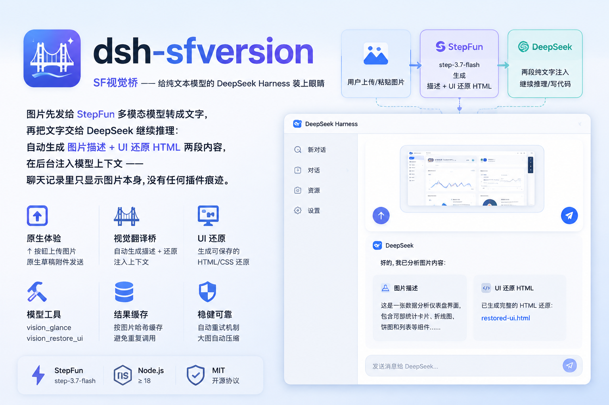

# dsh-sfversion

**SF视觉桥** —— 给纯文本模型的 DeepSeek Harness 装上眼睛。

图片先发给 StepFun 多模态模型转成文字,再把文字交给 DeepSeek 继续推理:自动生成 **图片描述 + UI 还原 HTML** 两段内容,在后台注入模型上下文——聊天记录里只显示图片本身,没有任何插件痕迹。项目的UI复原功能使用了[dsh-vision-toolkit](https://github.com/Anionex/dsh-vision-toolkit/tree/main)的部分功能。

## 特性

- **原生体验**:输入框左侧 ↑ 按钮把图片作为**原生草稿附件**加入输入框,与输入内容作为**同一条消息**一次性发送,无确认步骤;
- **官方视觉翻译桥**:实现宿主 `visionTranslation` 服务——输入框直接**粘贴/拖入**的图片、`read_image` 工具读出的图片,在模型请求前自动替换为「描述 + UI 还原」两段干净文字,持久化历史保留原图;
- **UI 还原**:每张图都会同时生成可保存的完整 HTML/CSS 还原(内联样式、无外部资源、逐字保留可见文字);
- **模型工具**:`vision_glance`(描述/OCR)、`vision_restore_ui`(还原为 HTML 文件);
- **结果缓存**:按图片内容哈希缓存到工作区 `.dsh-sfversion-cache.json`,重复图片不重复调用模型;
- **稳健性**:503/429/超时/网络抖动自动重试;推理模型的思考过程绝不泄漏给 DeepSeek;大图(>5MB)浏览器内自动压缩。

## 思考链路

```
用户上传/粘贴图片
      │
      ▼
原生图片消息(聊天里显示图片)
      │
      ▼  模型请求前(宿主 visionTranslation)
StepFun step-3.7-flash 生成:描述 + UI 还原 HTML
      │
      ▼
两段纯文字注入 DeepSeek 上下文,继续推理/写代码
```

## 安装

1. 把本目录安装为 dsh profile 可解析的包(任选其一):

   ```bash
   # 方式 A:复制到 profile 的 node_modules
   cp -r dsh-sfversion "$DSH_HOME/profiles/web/node_modules/dsh-sfversion"

   # 方式 B(开发):符号链接
   ln -s /path/to/dsh-sfversion "$DSH_HOME/profiles/web/node_modules/dsh-sfversion"
   ```

2. 在 profile 的 `cordis.patch.yml` 里插入插件行(或启动加 `--patch`):

   ```yaml
   - insert:
       - id: dsh-sfversion
         name: 'dsh-sfversion'
   ```

3. 配置 API Key(一次性):

   ```bash
   dsh credentials set STEPFUN_API_KEY sk-你的StepFun密钥
   ```

4. 重启 `dsh web`。

## 一键安装方法

复制下面这段提示词给DeepSeek Harness：
```
把 GitHub 仓库 https://github.com/sparkmio/dsh-sfversion 里的插件安装到本机 DeepSeek Harness 上。请按以下步骤完整执行,并在每步完成后确认结果:

1. **克隆源码**
   - 执行 `git clone https://github.com/sparkmio/dsh-sfversion.git` 到一个本地目录(如 `~/dsh-sfversion`)。
   - 该插件是一个零构建发行版 npm 包:宿主插件在 `lib/index.js`,浏览器插件 bundle 在 `lib/client.js`,不需要编译。

2. **确定 profile 目录**
   - 先执行 `echo $DSH_HOME`(Windows 为 `echo %USERPROFILE%\.dsh`),找到 DeepSeek Harness 的 home 目录。
   - 当前使用的 profile 位于 `$DSH_HOME/profiles/<profile 名>/`(通常为 `web`)。以该目录下存在 `cordis.yml` 和 `cordis.patch.yml` 为准。

3. **把插件包安装进 profile 的 node_modules**
   - 目标路径:`$DSH_HOME/profiles/node_modules/dsh-sfversion`(注意是 `profiles` 下的 node_modules,不是 `profiles/<profile>` 下的)。
   - 推荐用符号链接/junction 挂接源码目录,便于后续更新;直接复制整个目录也可以。
   - 完成后确认 `lib/index.js`、`lib/client.js`、`package.json` 三个文件都存在于目标路径。

4. **写入插件行**
   - 编辑 `$DSH_HOME/profiles/<profile>/cordis.patch.yml`(若不存在则创建),追加以下内容(保留已有内容,不要覆盖):

     ```yaml
     - insert:
         - id: dsh-sfversion
           name: 'dsh-sfversion'
     ```

   - 确认 YAML 缩进正确、顶层是数组。

5. **配置 API Key(一次性)**
   - 执行 `dsh credentials set STEPFUN_API_KEY <你的 StepFun API Key>`。
   - Key 可在 https://platform.stepfun.com 获取;插件默认调用 `step-3.7-flash` 模型。

6. **重启并验证**
   - 完全重启 DeepSeek Harness(如 `dsh web`,先 Ctrl+C 停掉再重新启动)。
   - 验证标准(按优先级):
     a. 启动日志无 `dsh-sfversion` 相关的报错或 "did not activate" 提示;
     b. 浏览器输入框左侧出现一个向上的箭头(↑)按钮,选图后图片作为附件进入输入框;
     c. 设置页出现「StepFun 视觉」条目;
     d. Agent 的工具列表中出现 `vision_glance` 和 `vision_restore_ui` 两个工具。

7. **失败处理**
   - 若启动报错,把完整日志保留并逐条排查:常见原因是插件行写错位置、包路径未解析(检查第 3 步的目录层级)、或 `STEPFUN_API_KEY` 未设置(第 5 步)。
   - 插件行为说明:上传/粘贴的图片以原生图片消息发送,聊天里只显示图片;DeepSeek 会在后台自动获得「图片描述 + UI 还原 HTML」,无需任何额外操作。

最后汇报:每步的执行结果、profile 的实际路径、以及验证标准 a–d 的通过情况。
```

## 使用

- **点 ↑ 选图** → 图片进入输入框 → 打字按发送 → 一条消息发出,DeepSeek 自动获得描述 + 还原;
- **直接粘贴/拖入**图片到输入框 → 同样自动翻译;
- 让 Agent 分析工作区图片:`vision_glance <路径>`;按图还原 UI:`vision_restore_ui <路径>` → 保存为 `restored-ui.html`;
- 设置 → **StepFun 视觉** 页面可查看配置与指引。

## 默认配置

| 项 | 值 |
|---|---|
| 视觉模型 | `step-3.7-flash` |
| 接口 | `https://api.stepfun.com/v1` |
| 推理强度 | `low` |
| 最大输出 tokens | 3000 |
| API Key | DSH Credential `STEPFUN_API_KEY` |

## 包结构

```
dsh-sfversion/
├── lib/
│   ├── index.js      # 宿主插件:visionTranslation 服务 + 工具 + 缓存(零构建,ESM)
│   └── client.js     # 浏览器插件 bundle:上传按钮/横条/设置页(手写 __ModuleLoader__ 格式)
├── cordis.patch.yml  # 部署补丁(insert 插件行)
└── package.json      # dsh.client 声明 + exports
```

## 要求

- DeepSeek Harness Web(或任何带 `visionTranslation` 消费方的组合);
- Node.js ≥ 18(宿主使用全局 fetch);
- 有效的 [StepFun 平台](https://platform.stepfun.com) API Key。

## License

MIT
